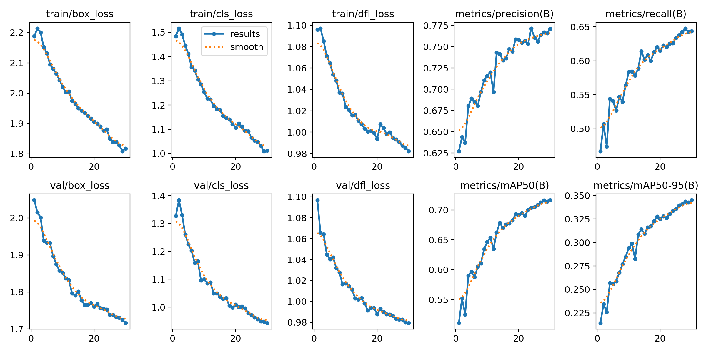
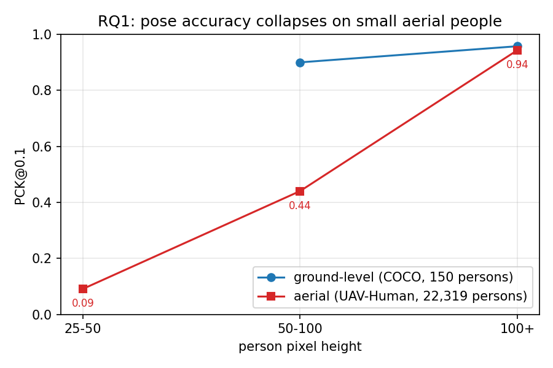
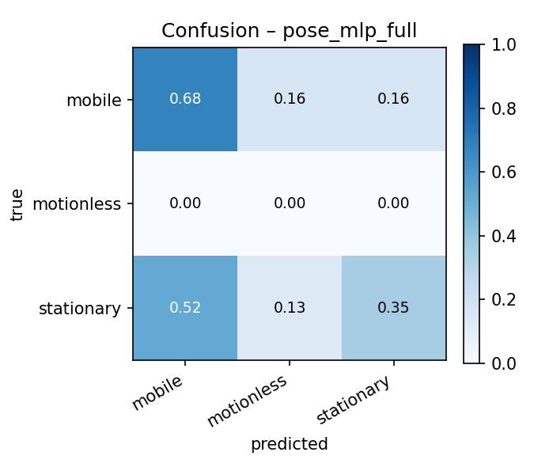
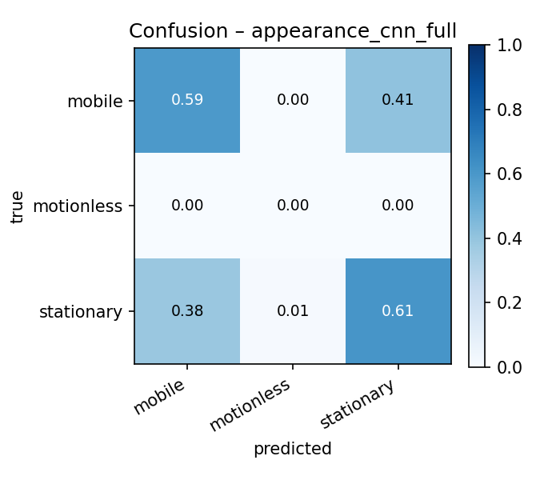
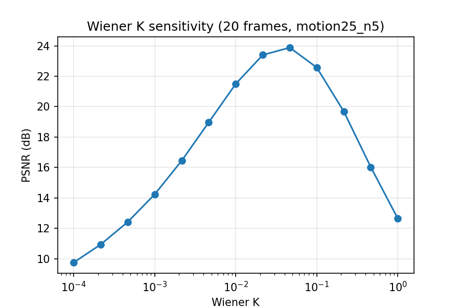
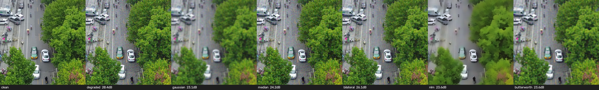
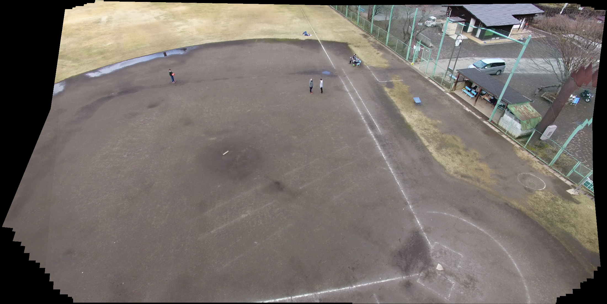
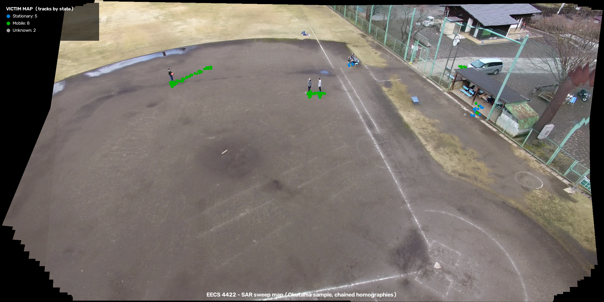

# Pose-Based Human State Recognition for Search-and-Rescue Drones

**Course:** EECS 4422 Computer Vision, Summer 2026, York University
**Team:** Nataliia Kobrii, Daniel Vinitski, and Nityam Goyal

## Abstract

We build and study a person detection → tracking → pose estimation → state
classification pipeline for aerial search-and-rescue (SAR) video, and treat the
pipeline as a controlled investigation of four questions. First, we quantify the
degradation of a ground-level pose estimator on aerial imagery and show that it
is governed by person size rather than by viewpoint: on 22,319 UAV-Human persons,
PCK@0.1 falls from 0.944 for people taller than 100 px to 0.440 in the 50-100 px
band and 0.091 below 50 px. Second, we ask whether an explicit pose
representation outperforms an appearance-only baseline for triage-state
classification; under a strict video-level split, the appearance model narrowly
leads (macro-F1 0.399 against 0.363), and both models fail on the rare motionless
class. Third, we evaluate frequency-domain restoration of degraded aerial frames
and demonstrate that pixel-quality gains do not imply task gains: on additive
noise, non-local means raises PSNR yet lowers detection AP below the degraded
baseline, whereas a simple median filter improves it. Fourth, we compare SIFT,
ORB and a self-supervised learned descriptor on HPatches and apply a
homography-based registration that turns per-frame triage into a single victim
map. All final numbers derive from one fine-tuned detector checkpoint
(AP50 0.709 on VisDrone-person).

## 1. Introduction and Motivation

In search-and-rescue operations, drones can sweep a disaster area far faster than
ground teams, but raw aerial video still requires a human operator to locate
people and judge their condition. The operator is therefore the bottleneck. The
judgement that matters most for triage — whether a person is lying motionless or
signalling for help — is fundamentally a human pose estimation problem. Detection
alone yields only a map of dots; adding an estimate of each person's state yields
a priority list, for example three motionless, five signalling and many walking,
which is the information an operator needs first.

Modern pose estimators, however, are trained on ground-level photographs, while a
drone observes people from above, at steep angles, and at very small pixel sizes.
This work builds the full aerial SAR pipeline and uses it to study two questions
from the project proposal, together with two questions added to broaden the
computer-vision scope:

- **RQ1 (domain gap).** How much does a COCO-pretrained 2D pose estimator degrade
  under aerial viewpoints and small person scales, and how much of that loss can
  lightweight fine-tuning recover?
- **RQ2 (does pose matter?).** For classifying a person's state from a drone, does
  an explicit pose representation outperform an appearance-only baseline?
- **RQ3 (restoration).** Frequency-domain deblurring and denoising of aerial
  frames, evaluated both intrinsically (PSNR, SSIM, runtime) and extrinsically
  (recovered detection AP and pose PCK).
- **RQ4 (matching and mapping).** SIFT against ORB against a learned descriptor
  under viewpoint, scale and illumination change, and a homography registration
  that aggregates the per-frame triage into one victim map.

The two added questions follow directly from the deployment setting: drones
vibrate and operate in low light, which motivates restoration (RQ3), and
operators need a single map rather than per-frame images, which motivates
registration (RQ4).

## 2. Related Work

**Aerial detection and pose.** Aerial person detection has been driven by the
VisDrone benchmark. Top-down 2D pose estimation is represented by RTMPose and
ViTPose, which first detect a person and then regress keypoints within the box;
this design suits aerial imagery, where people are small and sparse.
Skeleton-based action recognition, such as the ST-GCN family, operates on
estimated keypoint sequences and motivates a pose-based state classifier.

**Restoration.** Classical restoration includes Wiener filtering and
Richardson-Lucy deconvolution for known point spread functions, and spatial
filters (Gaussian, median, bilateral, non-local means) for denoising. Learned
deblurring is typically evaluated on the GoPro benchmark; we deliberately study
the classical regime with a known point spread function to isolate method
behaviour.

**Local features.** SIFT and ORB are the standard hand-crafted descriptors, and
HPatches is the standard evaluation benchmark. Learned patch descriptors include
L2-Net and HardNet; our TinyDescNet is a scaled-down descriptor trained with the
HardNet loss.

## 3. Data

| Dataset | Role | Scale used |
|---|---|---|
| VisDrone-person | detector fine-tuning and restoration frames | 548 validation images, 13,969 boxes |
| COCO (val subset) | ground-level pose reference | 150 persons, 1,900 keypoints |
| UAV-Human (pose) | aerial pose evaluation (RQ1) | 22,319 persons, 334,217 keypoints |
| Okutama-Action | state classification, registration, demo | multiple videos; sample video has 2,272 labelled frames |
| HPatches (sequences) | descriptor matching (RQ4) | 116 sequences, 580 pairs |

**State taxonomy.** Okutama-Action provides twelve action labels but no
*Waving* class, which we verified on the annotations. We therefore group the
actions into three SAR-relevant states using `src/config.py`: *motionless*
(Lying), *stationary* (Sitting, Standing, Reading, Drinking, Calling, Hand
Shaking, Hugging) and *mobile* (Walking, Running, Carrying, Pushing/Pulling). A
box with several actions is resolved by the precedence
motionless > signalling > mobile > stationary, so that the most urgent state
dominates. The absence of a signalling class is a limitation discussed in
Section 7. In the sample video the state distribution is 8,433 stationary, 5,559
mobile, 1,337 motionless and 205 unknown boxes.

**RQ3 degradation protocol.** We apply six synthetic degradations with known
ground truth to VisDrone frames, defined in `src/eval_restore.py::conditions()`:
two motion blurs (`motion15_n2`, `motion25_n5`), one defocus blur
(`defocus7_n2`), two Gaussian noise levels (`noise15`, `noise25`) and one
salt-and-pepper condition (`saltpepper4`). Known ground truth permits both
intrinsic and extrinsic evaluation. The professor's specification explicitly
permits synthetic degradation for this study.

**RQ4 benchmark.** We use the HPatches viewpoint and illumination sequences with
their ground-truth homographies. TinyDescNet is trained on self-supervised
aerial patch pairs from Okutama frames, which do not overlap with the benchmark.

## 4. Method

**Pipeline.** The pipeline is detection → tracking → pose → features →
classification → triage overlay.

**Detection and tracking.** We use YOLO11s for person detection and ByteTrack for
tracking. The detector is fine-tuned on the person-only VisDrone subset for 30
epochs at an input size of 1280.

**Pose.** RTMPose-m is applied top-down to each tracked box. The top-down design
is appropriate for aerial scenes because it allocates full model resolution to
each small person, rather than sharing it across a sparse image.

**Features.** From the 17 COCO keypoints and the person box, `src/features.py`
constructs a 47-dimensional vector per track window: 34 keypoint coordinates
normalised to the mid-hip and scaled by the torso length; seven geometric
features (the body-axis angle from vertical, the box aspect ratio, four
raised-wrist flags, and the mean keypoint confidence); and six temporal features
over the window (the vertical spread and speed of each wrist relative to the box
centre, the centre speed, and the box-size variation). The window length is
W = 15 frames, with overlapping windows for more training examples and per-frame
noise smoothing. The temporal features occupy the last six dimensions, which
allows a controlled ablation.

**Classifiers.** We compare a PoseMLP on the feature vector against an
AppearanceCNN on raw person crops. Both use identical splits and an identical
training loop, so the comparison isolates the representation.

**Restoration (RQ3).** We model a degraded frame as g = h * f + n, where f is the
clean frame, h a blur point spread function applied by circular convolution, and
n additive noise. Circular convolution is used so that the 2D Fourier transform
diagonalises the blur exactly and the measured quality reflects the restoration
method rather than boundary handling. We compare the pseudo-inverse filter, the
Wiener filter (whose constant K acts as a noise-to-signal regulariser),
Richardson-Lucy deconvolution, and spatial baselines (Gaussian, median,
bilateral, non-local means, and unsharp masking).

**Matching and registration (RQ4).** With a fixed SIFT keypoint detector, we
compare the SIFT descriptor, the ORB descriptor and TinyDescNet using the Lowe
ratio test. For the applied result, we estimate homographies between frames with
RANSAC, chain them to a common reference, build a mosaic, and project the foot
point of every track onto it, which produces a single victim map under a
planar-scene assumption.

**Metrics.** Detection uses our own AP@0.5 implementation. Pose uses PCK@0.1
normalised by the box size and stratified by person pixel height; box-size
normalisation is appropriate at aerial scale because it makes the threshold
proportional to the person rather than to the image. Classification uses macro-F1
and per-class F1. Restoration uses our own PSNR and SSIM implementations and
wall-clock runtime. Matching uses mean matching accuracy at several pixel
thresholds and the homography corner error.

## 5. Experiments and Results

All full-scale numbers use the fine-tuned detector checkpoint
`models/yolo11s_visdrone_best.pt`. The complete tables are in `results/`.

### 5.1 Detection foundation

On the 548-image VisDrone-person validation set (13,969 boxes), fine-tuning
raises AP50 from 0.437 (zero-shot COCO model) to 0.709, and recall from 0.596 to
0.859 (`detection/tables/detection_visdrone.csv`). The training curves and
confusion matrices are in `detection/runs/yolo11s_visdrone_ft/`. This confirms
that the aerial domain gap for detection is substantial and that a 30-epoch
fine-tune closes much of it.

*Figure 1. Fine-tuning curves for the VisDrone-person detector (notebook 01).*

| detector | AP50 | recall |
|---|---|---|
| yolo11s zero-shot (COCO) | 0.437 | 0.596 |
| yolo11s fine-tuned (30 epochs) | **0.709** | **0.859** |

### 5.2 RQ1 — the aerial pose gap is a function of person size

The ground-level reference measurement gives PCK@0.1 = 0.95 (COCO subset, 150
persons) and confirms that the evaluator and estimator are sound. The full aerial
evaluation applies RTMPose-m zero-shot over all UAV-Human frames (22,319 persons,
334,217 keypoints; `pose_domain_gap/tables/pck_uavhuman_zeroshot.json`).

| domain | PCK@0.1 | h25-50 px | h50-100 px | h100+ px |
|---|---|---|---|---|
| ground-level (COCO) | 0.95 | – | 0.90 | 0.958 |
| aerial (UAV-Human) | 0.942 | **0.091** | **0.440** | 0.944 |

The overall aerial PCK is within one point of the ground-level value, but when
stratified by person height the accuracy declines sharply: it remains high above
100 px, is halved in the 50-100 px band, and approaches total failure below
50 px (Figure `rq1_pck_vs_scale.png`). The aerial pose gap is therefore primarily
a function of person size rather than of viewpoint. A downscale ablation (persons
reduced to 35 % of their size) reproduces the same degradation, which isolates
scale as the cause. This finding also explains the RQ2 result below, because the
pose features become unreliable precisely where the keypoints do.

*Figure 2. PCK@0.1 against person pixel height: ground-level against aerial.*

As a label-free recovery attempt, we train a student pose model (yolo11n-pose)
on Okutama pseudo-labels for 20 epochs, reaching pose mAP@0.5 = 0.508 and
mAP@0.5:0.95 = 0.307 (`pose_domain_gap/runs/pose_ft/`). A full before-and-after
PCK quantification of this recovery is left to future work (Section 8).

### 5.3 RQ2 — pose against appearance

We hold out whole videos, which is stricter than a track-level split and tests
cross-video generalisation. Both models use identical splits and training
(`tables/rq2_full.csv`; confusion matrices `figures/confusion_*_full.png`).

| model | macro-F1 | F1 mobile | F1 stationary | F1 motionless |
|---|---|---|---|---|
| PoseMLP (pose features) | 0.363 | 0.631 | 0.458 | 0.000 |
| AppearanceCNN (raw crops) | **0.399** | 0.611 | 0.588 | 0.000 |

Two findings emerge. First, both models fail on the rare motionless class
(F1 = 0), whereas at single-video scale the same models reached 0.5-0.7;
video-level generalisation is considerably harder, and the motionless class
(persons lying down) is the most affected. Second, the appearance model narrowly
outperforms the pose model, but the margin is only 0.036, which is consistent
with RQ1: the pose features are limited by unreliable keypoints on persons
30-80 px tall, while the appearance model loses the track-level background cue it
could otherwise exploit once whole videos are held out.

*Figure 3. Confusion matrix of the PoseMLP classifier.*

*Figure 4. Confusion matrix of the AppearanceCNN classifier.*

### 5.4 RQ3 — restoration

**Intrinsic quality** over 200 VisDrone frames, best method per condition in PSNR
(dB) (`tables/restoration_intrinsic_full.csv`):

| condition | degraded | best deblur | best denoise |
|---|---|---|---|
| motion15_n2 | 23.8 | rl20 26.7, wiener 25.9; inverse 8.4 (fails) | – |
| motion25_n5 | 22.5 | rl20 24.1, wiener 23.5 | – |
| defocus7_n2 | 23.3 | wiener 25.5, rl20 25.2 | – |
| noise25 | 20.5 | – | bilateral 27.3, nlm 26.7 |
| saltpepper4 | 19.1 | – | median 27.8 |

Frequency-domain methods perform best on the blur conditions — the Wiener filter
matches Richardson-Lucy at a fraction of the runtime, and the pseudo-inverse
filter exhibits the expected noise amplification — while nonlinear spatial
filters perform best on the noise conditions, with each noise type requiring a
different filter. The Wiener K sweep peaks at K = 0.046
(`figures/restoration_wiener_k_full.png`).

**Extrinsic evaluation** — whether restoration recovers detection accuracy — over
all 548 images (`tables/restoration_extrinsic_detection_full.csv`):

| condition | clean | degraded | best restore | others |
|---|---|---|---|---|
| motion25_n5 | 0.709 | 0.025 | wiener 0.091 | rl20 0.079, unsharp 0.011 |
| noise25 | 0.709 | 0.460 | median 0.496 | butterworth 0.428, nlm 0.387 |

The principal finding holds at full scale: PSNR does not measure task utility. On
noise, non-local means attains high PSNR yet reduces detection accuracy (0.387,
below the 0.460 degraded baseline) by smoothing away small persons, whereas the
median filter is the only method that improves it. At blur comparable to the
person size, detection accuracy is not recoverable (0.025; the Wiener filter
reaches only 0.091), because the information is destroyed rather than obscured. A
complementary pose evaluation at local scale (200 UAV-Human persons,
`tables/restoration_extrinsic_pose.csv`) shows the opposite, milder trend for
blur: the Wiener filter restores PCK from 0.931 to 0.952, close to the clean
0.958, because pose is measured on larger, already-detected persons. A
restoration method must therefore be validated on the downstream task.

*Figure 5. Wiener-filter K sensitivity (PSNR against K).*

*Figure 6. Qualitative denoising results under the noise25 condition.*

### 5.5 RQ4 — matching and the victim map

On all 116 HPatches sequences (285 illumination and 295 viewpoint pairs;
`tables/matching_hpatches.csv`):

| method | MMA@3 illum | MMA@3 vp | MMA@1 vp | corner err vp (px) | ms/pair |
|---|---|---|---|---|---|
| SIFT | 0.700 | 0.710 | 0.466 | 51.7 | 148-251 |
| ORB | 0.675 | 0.670 | 0.283 | 119.9 | 52-79 |
| TinyDescNet | 0.646 | 0.601 | 0.383 | 93.5 | ~2050 |

SIFT attains the highest accuracy and geometric precision, particularly under
viewpoint change. ORB exchanges accuracy for a three-to-five-fold speedup and
degrades sharply at the strict 1-pixel threshold under viewpoint change (MMA@1
0.28), which is adequate for coarse alignment but weaker for map building. The
self-supervised TinyDescNet nearly matches SIFT under illumination change (MMA@1
0.505 against 0.522) but performs worse under viewpoint change, which is
consistent with training only on aerial appearance perturbations rather than on
geometric warps.

**Applied result.** Using SIFT and RANSAC, we register every twelfth frame of a
288-frame Okutama sweep (24 registered frames, mean 904.6 inliers per link,
minimum 610), chain the homographies to the first frame, and build a 2200×1104
mosaic (`figures/registration_mosaic_1.1.1.png`). Projecting the foot point of
each pipeline track onto the mosaic produces a single victim map
(`figures/victim_map_1.1.1.png`, `tables/registration_stats_1.1.1.json`), which
converts the per-frame triage overlay into one operator-facing map of the sweep.

*Figure 7. SIFT and RANSAC mosaic of the 288-frame Okutama sweep.*

*Figure 8. Victim map: per-track states projected onto the mosaic.*

### 5.6 Qualitative and failure analysis

The most instructive failures are consistent with the quantitative results:
missed detections and pose-estimation failure on very small persons (RQ1), motionless
persons misclassified as stationary because their keypoints are unreliable
(RQ2), the pseudo-inverse filter amplifying noise into unusable frames (RQ3), and
mosaic drift as the chained homography error accumulates over a long sweep (RQ4).

## 6. Demo

The final demonstration video, `results/videos/demo_final.mp4`, runs the full
pipeline (fine-tuned detector, ByteTrack, RTMPose, PoseMLP state classifier and
triage overlay) over 1,800 frames of an Okutama video, with per-person states
colour-coded by urgency.

## 7. Conclusions

This work built a complete aerial search-and-rescue triage pipeline and used it to
answer four questions with consistent, full-scale evidence. The aerial pose gap is
primarily a function of person size rather than of viewpoint: accuracy is close to
the ground-level value for large persons but falls to 0.44 in the 50-100 px band
and to 0.09 below 50 px. For triage-state classification under a strict
video-level split, an appearance baseline slightly outperforms an explicit pose
representation (macro-F1 0.399 against 0.363), and both models fail on the rare
motionless class, which locates the difficulty in the small-person regime
identified in RQ1. For restoration, an improvement in pixel quality does not imply
an improvement in task performance: on additive noise, non-local means raises PSNR
yet lowers detection accuracy, whereas a median filter improves it, so a
restoration method must be validated on the downstream task. For matching, SIFT
remains the most accurate and geometrically precise descriptor, ORB is
substantially faster at a cost in precision, and a small self-supervised
descriptor approaches SIFT under illumination change but not under viewpoint
change. Taken together, these results give a realistic account of where an aerial
search-and-rescue pipeline succeeds and where it fails.

## 8. Assumptions, Limitations, and Future Work

**Assumptions.** The state taxonomy assumes the three search-and-rescue-relevant
classes (motionless, stationary, mobile), because Okutama-Action provides no
signalling class. Pose accuracy is measured with PCK@0.1 normalised by the person
box, which assumes that the box is an adequate proxy for scale at aerial
resolution. The restoration study assumes a known point spread function and models
blur with circular convolution. The registration and victim map assume a planar
scene, so that a homography is an adequate frame-to-frame model, and the
foot-point projection assumes that people stand on flat ground.

**Limitations and future work.**

- **No signalling class.** Okutama-Action contains no *Waving* class, so the
  taxonomy is motionless, stationary and mobile; a signalling class would require
  a dataset such as UAV-Gesture.
- **RQ1 recovery.** The pseudo-label student model is trained but its
  before-and-after PCK recovery is not yet quantified at full scale; this and the
  UAV-Human fine-tuning variant are the natural next step.
- **RQ2 ablations.** The window-size, crop-resolution and temporal-feature
  ablations described in notebook 03 are not included at full scale; they, and a
  detection resolution ablation (640 against 1280), remain to be run.
- **RQ3 assumptions.** The setting is non-blind (the point spread function is
  known) and uses circular convolution (no realistic boundary effects); blind
  point-spread-function estimation and learned deblurring are future work.
- **RQ4 mapping.** The registration assumes a planar scene and drifts over long
  sweeps; loop closure or bundle adjustment would reduce this drift, and the
  victim map is in mosaic rather than geographic coordinates, which would require
  camera GPS and intrinsics.
- **Scale of some artifacts.** The registration and victim map are demonstrated on
  one video, and the pose-under-degradation evaluation is at local scale.

## 9. Contributions

*(This division reflects the repository history and should be confirmed and
completed by the team.)* Daniel Vinitski led the detector fine-tuning (Section
5.1) and the aerial pose-gap evaluation together with the student pose model
(Section 5.2). Nataliia Kobrii led the pipeline integration, the
state-classification comparison (Section 5.3), the restoration study (Section
5.4), the matching and registration study (Section 5.5), the consolidation of the
full-scale results, and this report. ⟨The specific contributions of Nityam Goyal
are to be completed by the team.⟩ The `src/` library and the notebook framework
are shared work.

## Appendix — Reproducibility

Each module is one notebook (`notebooks/01`–`06`); the README lists the exact
commands. Full-scale detection and pose training ran on Colab GPUs; the remaining
experiments ran locally on an Apple M1 Pro (the MPS backend and CPU). Random
seeds are fixed in the scripts, and all evaluators (AP, PCK, PSNR, SSIM, matching
accuracy) are our own implementations in `src/`. Result tables and figures are in
`results/`, and the numbers in this report are also collected in
`results/RESULTS.md`.

## References

The following standard works should be cited and formatted to the course style;
the author-year keys are given for convenience: SIFT (Lowe, 2004); ORB (Rublee et
al., 2011); ByteTrack (Zhang et al., 2022); RTMPose (Jiang et al., 2023); ViTPose
(Xu et al., 2022); ST-GCN (Yan et al., 2018); L2-Net (Tian et al., 2017); HardNet
(Mishchuk et al., 2017); HPatches (Balntas et al., 2017); VisDrone (Zhu et al.,
2021); Okutama-Action (Barekatain et al., 2017); UAV-Human (Li et al., 2021);
GoPro deblurring (Nah et al., 2017); Wiener filtering (Wiener, 1949);
Richardson-Lucy deconvolution (Richardson, 1972; Lucy, 1974).
