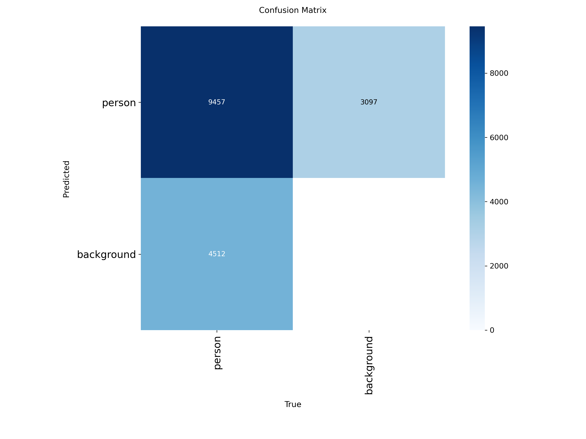
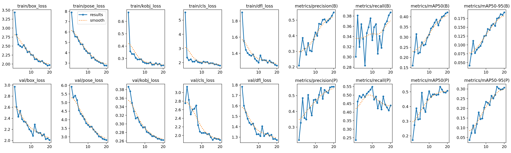
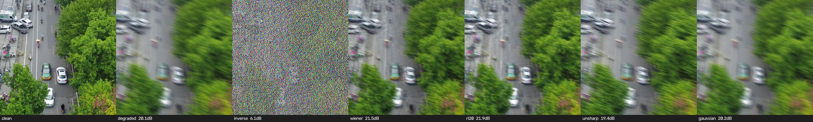
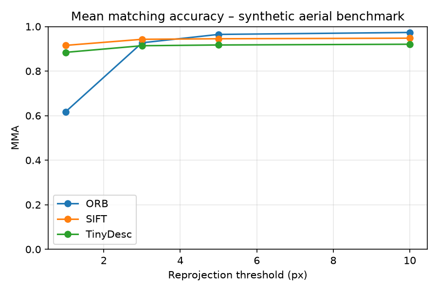
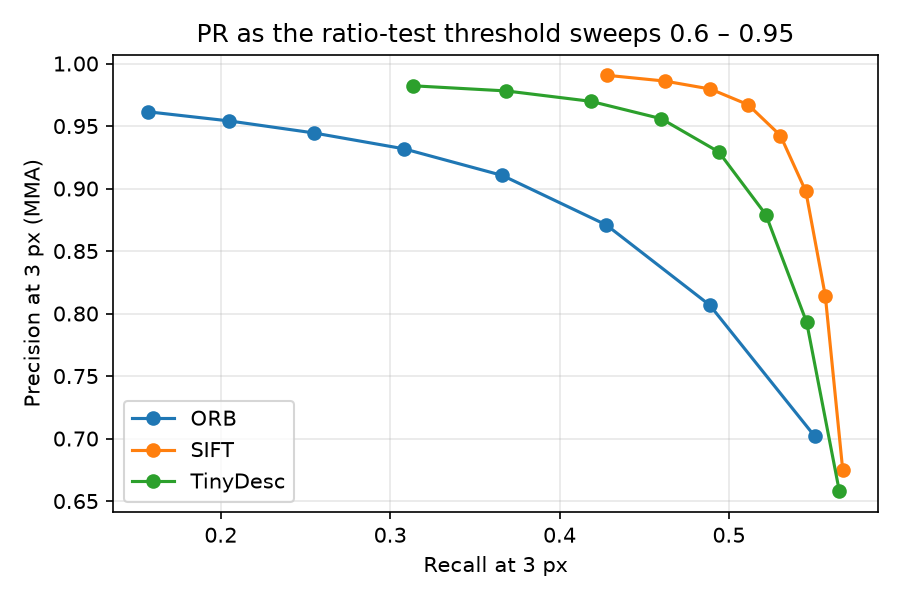
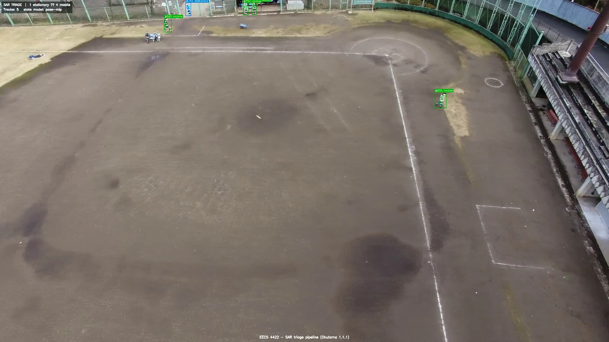

# Pose-Based Human State Recognition for Search-and-Rescue Drones

**Course:** EECS 4422 Computer Vision, Summer 2026, York University
**Team:** Nataliia Kobrii, Daniel Vinitski, and Nityam Goyal

## Abstract

We build and study a pipeline for person detection, tracking, pose estimation,
and state classification in aerial search-and-rescue (SAR) video, and treat the
pipeline as a controlled investigation of four research questions. First, we
quantify the degradation of a ground-trained two-dimensional pose estimator on
aerial imagery and show that it is governed by person size rather than by
viewpoint: on 22,319 UAV-Human persons, the percentage of correct keypoints at a
threshold of 0.1 falls from 0.944 for people taller than one hundred pixels to
0.440 in the fifty-to-one-hundred-pixel band and 0.091 below fifty pixels.
Second, we ask whether an explicit pose representation outperforms an
appearance-only baseline for triage-state classification; under a strict
video-level split, the appearance model narrowly leads (macro-averaged F1 of
0.399 against 0.363), and both models fail on the rare motionless class. Third,
we evaluate frequency-domain restoration of degraded aerial frames and
demonstrate that improvements in pixel quality do not imply improvements in task
performance: on additive noise, the non-local means filter raises the peak
signal-to-noise ratio yet lowers detection average precision below the degraded
baseline, whereas a simple median filter improves it. Fourth, we compare the
SIFT descriptor, the ORB descriptor, and a compact self-supervised descriptor on
the HPatches benchmark, and apply a homography-based registration that converts
the per-frame triage overlay into a single victim map. All final results derive
from one fine-tuned detector checkpoint that attains an average precision at an
intersection-over-union of 0.5 of 0.709 on the VisDrone person subset.

## 1. Introduction and Motivation

In a search-and-rescue (SAR) operation, an unmanned aerial vehicle can sweep a
disaster area far more quickly than a ground team. Nevertheless, the raw aerial
video still requires a human operator to locate people and to judge their
condition, and this human step is the bottleneck of the process. A system that
merely detects people produces a map of dots: it tells the operator where people
are but not who needs help first. The information that matters for triage is the
*state* of each person — whether a person is lying motionless, and therefore
possibly unconscious or injured, or standing and moving, and therefore likely
able to assist themselves. This distinction between a motionless person and an
active one is fundamentally a question of human posture, and posture is estimated
by human pose estimation. This observation motivates the entire project.

Modern two-dimensional pose estimators, however, are trained predominantly on
ground-level photographs, in which people are large and viewed from the side or
front. A drone observes people from above, at steep angles, and at very small
pixel sizes. The central practical risk is therefore a *domain gap*: a pose
estimator that is accurate on the ground may be unreliable in the air. This work
constructs the complete aerial SAR pipeline and uses it as an instrument to
answer two research questions from the original project proposal, together with
two additional questions that broaden the computer-vision scope of the project.

- **RQ1 (domain gap).** How much does a two-dimensional pose estimator trained on
  ground-level images degrade under aerial viewpoints and small person scales,
  and how much of that loss can lightweight fine-tuning recover?
- **RQ2 (does pose help?).** For classifying a person's state from a drone, does
  an explicit pose representation outperform an appearance-only baseline?
- **RQ3 (restoration).** Does classical, frequency-domain deblurring and
  denoising of aerial frames recover not only pixel quality but also the
  downstream detection and pose accuracy?
- **RQ4 (matching and mapping).** How do the SIFT descriptor, the ORB descriptor,
  and a learned descriptor compare under viewpoint, scale, and illumination
  change, and can a homography-based registration aggregate the per-frame triage
  into a single map?

The two added questions follow directly from the deployment setting. Drones
vibrate and operate in poor light, which produces blurred and noisy frames and
motivates restoration (RQ3). Operators need a single map of the searched area
rather than a stream of per-frame images, which motivates registration (RQ4).
Together, the four questions give a realistic account of where an aerial triage
pipeline succeeds and where it fails.

The contribution of the project is therefore not a single new model but a
controlled, end-to-end account of the aerial triage problem, in which every claim
is supported by a full-scale measurement produced by our own evaluators. Each
research question is designed so that its answer is informative whether it is
positive or negative: a negative result, such as the finding that an explicit
pose representation does not yet outperform an appearance baseline at aerial
scale, is reported and analysed rather than concealed, because it locates the
true difficulty of the problem.

## 2. Related Work

**Aerial person detection.** Object detection from aerial platforms has been
driven by the VisDrone benchmark [1], which provides annotated drone imagery
across a range of altitudes and viewpoints. Single-stage detectors of the YOLO
family are the standard practical choice for real-time aerial detection; we use
YOLO11 [2] as our detector. Multi-object tracking associates detections across
frames; we use ByteTrack [3], which associates every detection box, including
low-confidence boxes, and is robust to the brief occlusions common in aerial
video. Aerial detection is difficult chiefly because objects are small: a person
seen from an altitude of several tens of metres may occupy fewer than fifty
pixels, which places the task in the small-object regime where average precision
is known to fall most sharply.

**Human pose estimation.** Two-dimensional pose estimation is dominated by
top-down methods, which first detect a person and then regress keypoints within
the detected box. Representative models include HRNet [6], which maintains
high-resolution representations throughout the network, RTMPose [4], which is
optimised for real-time inference, and ViTPose [5], which applies a plain vision
transformer. The top-down design is well suited to aerial imagery, in which
people are small and sparse, because it allocates the full model resolution to
each person rather than sharing it across a largely empty image. We adopt RTMPose
as the pose estimator. A recurring limitation of these estimators for aerial use
is that their training distributions are dominated by large, ground-level people,
which is precisely the distribution shift that RQ1 measures.

**Pose-based action and state recognition.** Skeleton-based action recognition
operates on sequences of estimated keypoints. The spatial-temporal graph
convolutional network [7] and its successors treat the skeleton as a graph over
time. These methods motivate a pose-based state classifier, although in this work
we use a compact feature vector and a multilayer perceptron rather than a graph
network, because the number of frames per track is small and the classes are few.
The design choice reflects the data regime: a graph convolutional network has
many parameters and expects long, reliable skeleton sequences, whereas aerial
tracks are short and their keypoints are noisy, so a low-capacity model on
engineered features is a more honest baseline.

**Search-and-rescue datasets.** Datasets that specifically target aerial human
understanding include Okutama-Action [8], which provides aerial video with
concurrent human action labels, and UAV-Human [9], a large benchmark for human
behaviour understanding from drones that includes a pose-estimation subset. The
SARD line of work [25] studies person detection in explicit search-and-rescue
scenarios. General object context is provided by COCO [10], on which the baseline
detector and pose estimator are pretrained.

**Image restoration.** Classical restoration comprises deconvolution for blur and
filtering for noise. The Wiener filter [16] is the linear minimum-mean-squared-
error restoration filter, and Richardson-Lucy deconvolution [17, 18] is an
iterative method derived from a Bayesian model of image formation. For denoising,
the standard spatial methods are the median filter, the bilateral filter [20],
and the non-local means filter [19]. Learned deblurring is typically evaluated on
the GoPro benchmark [21]; we deliberately restrict our study to the classical
regime with a known point spread function so that the measured behaviour reflects
the restoration method rather than the boundary handling or an unknown blur.

**Local features and matching.** The SIFT descriptor [11] and the ORB descriptor
[12] are the standard hand-crafted local descriptors, trading accuracy against
speed. Learned patch descriptors include L2-Net [13] and HardNet [14], the latter
introducing a triplet loss with the hardest negative in the batch. HPatches [15]
is the standard benchmark for descriptor evaluation, with viewpoint and
illumination sequences and ground-truth homographies. Robust geometric estimation
uses RANSAC [22], and the multiple-view geometry underlying homography estimation
and mosaicking is standard [23]. Image quality is measured with the peak
signal-to-noise ratio and the structural similarity index [24].

## 3. Data

Table 1 summarises the datasets, their roles, and the scale at which we use them.

| Dataset | Role | Scale used |
|---|---|---|
| VisDrone-person [1] | detector fine-tuning; restoration frames | 548 validation images, 13,969 person boxes |
| COCO (validation subset) [10] | ground-level pose reference | 150 persons, 1,900 keypoints |
| UAV-Human (pose) [9] | aerial pose evaluation (RQ1) | 22,319 persons, 334,217 keypoints |
| Okutama-Action [8] | state classification; registration; demonstration | multiple videos; the sample video has 2,272 labelled frames |
| HPatches (sequences) [15] | descriptor matching (RQ4) | 116 sequences, 580 image pairs |

*Table 1. Datasets and the scale at which each is used.*

**State taxonomy.** Okutama-Action provides twelve action labels but no *Waving*
class, which we verified directly on the annotations. We therefore group the
actions into three SAR-relevant states, defined in `src/config.py`. The mapping is
given in Table 2. When a box carries several actions, a precedence rule selects
the most urgent state, ordered as motionless, then signalling, then mobile, then
stationary, so that the most urgent interpretation dominates. Because Okutama
contains no signalling actions, the signalling state does not occur in practice;
its presence in the precedence rule documents the intended design. In the sample
video the state distribution is 8,433 stationary, 5,559 mobile, 1,337 motionless,
and 205 unlabelled boxes.

| State | Actions mapped to it |
|---|---|
| motionless | Lying |
| stationary | Sitting, Standing, Reading, Drinking, Calling, Hand Shaking, Hugging |
| mobile | Walking, Running, Carrying, Pushing/Pulling |

*Table 2. Mapping from Okutama actions to triage states.*

The class distribution is strongly imbalanced, with the motionless state, which is
the most operationally important, represented by only 1,337 of the labelled boxes.
This imbalance is not an artefact to be removed but a property of the deployment
setting, in which the people who most need help are the fewest and the hardest to
observe, and it is addressed in training by class-balanced loss weighting rather
than by resampling.

**Restoration degradation protocol.** For RQ3 we apply six synthetic degradations
with known ground truth to VisDrone frames, defined in
`src/eval_restore.py::conditions()`. The conditions are two motion blurs, one
defocus blur, two Gaussian-noise levels, and one salt-and-pepper condition, listed
in Table 3. Known ground truth permits both intrinsic evaluation (comparing the
restored frame against the clean frame) and extrinsic evaluation (measuring the
downstream detection and pose accuracy). The professor's specification explicitly
permits synthetic degradation for this study.

| Condition | Blur | Noise |
|---|---|---|
| motion15_n2 | linear motion, length 15, angle 45 degrees | Gaussian, sigma 2 |
| motion25_n5 | linear motion, length 25, angle 20 degrees | Gaussian, sigma 5 |
| defocus7_n2 | disc defocus, radius 7 | Gaussian, sigma 2 |
| noise15 | none | Gaussian, sigma 15 |
| noise25 | none | Gaussian, sigma 25 |
| saltpepper4 | none | salt-and-pepper, 4 percent |

*Table 3. The six degradation conditions.*

**Matching benchmark.** For RQ4 we use the HPatches viewpoint and illumination
sequences with their ground-truth homographies. The learned descriptor,
TinyDescNet, is trained on self-supervised aerial patch pairs sampled from
Okutama frames; these frames do not overlap with the HPatches benchmark, so the
descriptor is never trained on the evaluation data.

## 4. Method

### 4.1 Pipeline overview

The pipeline comprises six stages: detection, tracking, pose estimation, feature
extraction, classification, and the triage overlay. A frame is passed to the
detector, which returns person boxes; the tracker links boxes across frames into
tracks; the pose estimator returns keypoints for each box; the feature stage
converts a short window of a track into a feature vector; the classifier assigns a
state; and the overlay draws each person in a colour that encodes the urgency of
their state. The stages are deliberately modular, so that a research question can
be studied in isolation: RQ1 exercises the pose stage, RQ2 the classification
stage, RQ3 a restoration stage inserted before detection, and RQ4 a matching stage
that operates on whole frames rather than on individual people.

### 4.2 Detection and tracking

We use YOLO11s [2] for person detection and ByteTrack [3] for tracking. The
detector is fine-tuned on the person-only subset of VisDrone for thirty epochs at
an input resolution of 1280 pixels. Fine-tuning adapts the ground-trained model
to the aerial domain, in which people are smaller and seen from above than in the
COCO pretraining data. The tracker associates detections into tracks using the
intersection-over-union of boxes across consecutive frames. ByteTrack retains
low-confidence detections for a second association pass, which is valuable in
aerial video because a small person frequently drops below the primary confidence
threshold for a few frames before reappearing.

### 4.3 Pose estimation

RTMPose-m [4] is applied top-down to each tracked box, returning seventeen
keypoints in the COCO format together with per-keypoint confidences. The top-down
design is appropriate for aerial scenes because it processes each person at full
model resolution rather than sharing resolution across a sparse image. Each box is
expanded slightly and resized to the estimator's input resolution before
inference, so that the effective resolution seen by the pose network depends on
the original pixel size of the person, which is the mechanism behind the
size-dependent accuracy measured in RQ1.

### 4.4 Feature representation

From the seventeen keypoints and the person box, `src/features.py` constructs a
feature vector of dimension 47 for each track window, composed of 34 normalised
keypoint coordinates, seven geometric features, and six temporal features.

The keypoints are normalised to be invariant to the person's position and size in
the image. Let m_hip be the midpoint of the hips and let the torso length be the
distance between the mid-hip and the mid-shoulder. Each keypoint k is transformed
as (k minus m_hip) divided by the torso length; when the torso collapses to nearly
zero, as in a near-top-down view or when hip and shoulder keypoints are missing,
the box diagonal is used as the scale. This yields 34 values (seventeen keypoints,
each with two coordinates).

The seven geometric features summarise the posture in one frame. The body-axis
angle is the angle from the vertical of the vector from the hips to the shoulders,
computed as arctan of the absolute horizontal component over the absolute vertical
component; a value near zero indicates an upright person and a value near ninety
degrees indicates a lying person. The box aspect ratio, the height divided by the
width, complements the angle, because a lying person tends to produce a wide,
short box. Four binary flags indicate whether each wrist is above the shoulders or
above the nose, which is the signature of a raised arm. The seventh feature is the
mean keypoint confidence, which acts as a reliability indicator.

The six temporal features summarise motion over the window, with all distances
normalised by the person's own size so that they measure motion relative to the
body rather than in raw pixels. The vertical standard deviation of each wrist,
relative to the box centre, is large when the arms move up and down, as in waving
(two features). The mean speed of each wrist relative to the box centre captures
arm motion independently of body motion (two features). The speed of the box
centre separates a moving person from a stationary one (one feature), and the
standard deviation of the box size captures approach and recession (one feature).

The window length is fifteen frames, and windows overlap so that each track
produces several training examples and the per-frame noise is smoothed. The label
of a window is the most frequent state among its frames, which is robust to a few
mislabelled or missing frames. The temporal features occupy the last six
dimensions, which permits a controlled ablation that removes them.

### 4.5 State classifiers

We compare two classifiers under identical splits and an identical training loop,
so that the comparison isolates the representation rather than the training
procedure. The PoseMLP is a small multilayer perceptron applied to the
47-dimensional feature vector. The AppearanceCNN is a small convolutional network
applied to the raw person crop. Both are trained with the same optimiser, the same
number of epochs, and class weights that balance the loss across the unequal state
counts; the class weight of a state is the total count divided by the count of
that state and by the number of classes. The contrast is deliberate: the PoseMLP
sees only the geometry of the skeleton and is blind to appearance, whereas the
AppearanceCNN sees pixels and can exploit texture and context but has no explicit
notion of posture. Comparing the two under identical conditions is what makes RQ2
a fair test of the value of an explicit pose representation.

### 4.6 Restoration (RQ3)

We model a degraded frame as g = h * f + n, where f is the clean frame, h is a
blur point spread function applied by circular convolution, and n is additive
noise. Circular convolution is used so that the two-dimensional Fourier transform
diagonalises the blur exactly; the measured quality then reflects the restoration
method rather than the boundary handling. Writing H for the Fourier transform of
the point spread function, G for that of the degraded frame, and the asterisk for
the complex conjugate, the methods are as follows.

The pseudo-inverse filter estimates the clean frame as F = H* G / max(|H|^2,
epsilon^2). It is retained as an instructive failure case, because wherever |H| is
close to zero the division amplifies whatever noise is present.

The Wiener filter is the linear minimum-mean-squared-error restoration filter. For
the additive-noise model, its transfer function is W = H* / (|H|^2 + K), where K
is a constant that stands in for the ratio of the noise power to the signal power.
Where the signal dominates, K is negligible and the filter behaves like the
inverse filter; where the noise dominates, K suppresses the corresponding
frequencies. We select K from the known noise level and confirm the choice with a
sweep.

Richardson-Lucy deconvolution [17, 18] is an iterative method that begins from a
flat estimate and, at each iteration, multiplies the current estimate by the
back-projected ratio of the observed frame to the current prediction. Because it
enforces non-negativity and is derived from a Poisson noise model, it preserves
edges better than the linear filters, at a substantially higher cost. We run
twenty iterations.

The spatial baselines are the Gaussian, median, bilateral [20], and non-local
means [19] filters, together with unsharp masking as a sharpening baseline. These
methods do not require the point spread function and therefore apply to any
degradation, but they cannot invert a blur. The median filter is nonlinear and is
particularly suited to impulsive salt-and-pepper noise, whereas the bilateral and
non-local means filters preserve edges by averaging only over photometrically
similar neighbourhoods.

### 4.7 Matching and registration (RQ4)

With a fixed SIFT keypoint detector, we compare three descriptors: the SIFT
descriptor [11], the ORB descriptor [12], and TinyDescNet, a compact convolutional
descriptor trained with the HardNet loss [14] on self-supervised aerial patch
pairs. Descriptors are matched with the Lowe ratio test, which accepts a match
only when the nearest-neighbour distance is smaller than 0.8 times the
second-nearest distance. Fixing the detector isolates the descriptor as the single
variable under study, so that any difference in matching accuracy is attributable
to the description of the patch rather than to where the patches are placed.

For the applied result, we estimate a homography between frames with RANSAC [22].
The number of RANSAC iterations required to obtain, with probability p, at least
one sample free of outliers is N = log(1 minus p) / log(1 minus w^s), where w is
the inlier fraction and s is the minimal sample size, which is four for a
homography. We chain the homographies to a common reference frame, build a mosaic,
and project the foot point of each track onto the mosaic under a planar-scene
assumption, which produces a single victim map.

### 4.8 Evaluation metrics

All metrics are our own implementations in `src/`, so that no result depends on a
library whose internal choices we cannot inspect.

**Detection.** We use the average precision at an intersection-over-union
threshold of 0.5, denoted AP50. The intersection-over-union of a predicted box A
and a ground-truth box B is IoU(A, B) = area(A intersect B) / area(A union B). A
prediction is a true positive when its intersection-over-union with an unmatched
ground-truth box is at least 0.5, and a false positive otherwise; unmatched
ground-truth boxes are false negatives. With precision = TP / (TP + FP) and
recall = TP / (TP + FN) computed as the confidence threshold is swept, AP50 is the
area under the resulting precision-recall curve.

**Pose.** We use the percentage of correct keypoints at a threshold of 0.1,
denoted PCK@0.1. A predicted keypoint p is correct when its Euclidean distance to
the ground-truth keypoint g satisfies the norm of (p minus g) at most 0.1 times a
reference length d taken from the person box, and PCK is the fraction of correct
keypoints, PCK = (1 / K) times the sum over the K keypoints of the correctness
indicator. The score is reported both overall and stratified by person pixel
height, which is the stratification that exposes the size effect in RQ1.

**Classification.** We use the macro-averaged F1 score, macro-F1 = (1 / C) times
the sum over the C classes of F1_c, where F1_c = 2 P_c R_c / (P_c + R_c) is the
harmonic mean of the per-class precision and recall. Because the classes are
averaged without weighting, a rare class such as motionless contributes as much as
a common one, which is the appropriate emphasis for triage.

**Restoration.** We use the peak signal-to-noise ratio and the structural
similarity index [24]. For an eight-bit image the peak signal-to-noise ratio is
PSNR = 10 log10 (255^2 / MSE), where MSE is the mean squared error between the
restored and the clean frame; a higher value indicates a smaller pixel error. The
structural similarity index between local windows x and y is SSIM = (2 mu_x mu_y +
C1)(2 sigma_xy + C2) / ((mu_x^2 + mu_y^2 + C1)(sigma_x^2 + sigma_y^2 + C2)), where
mu, sigma, and sigma_xy are the local means, variances, and covariance, and C1 and
C2 are small stabilising constants; it rewards structural rather than purely
pixel-wise agreement. We also report the wall-clock runtime per frame.

**Matching.** We use the mean matching accuracy at a pixel threshold t, denoted
MMA at t, which is the fraction of proposed matches whose reprojection error under
the ground-truth homography is below t pixels, averaged over the pairs. We also
report the mean homography corner error, the mean distance between the four image
corners mapped by the estimated homography and by the ground-truth homography,
which summarises the geometric quality of the estimate in a single number of
pixels.

## 5. Experiments and Results

All full-scale numbers use the fine-tuned detector checkpoint
`models/yolo11s_visdrone_best.pt`, and all evaluators are our own implementations
in `src/`. The complete tables are stored in `results/`.

### 5.1 Detection foundation

Detection is the foundation of the pipeline, so we first quantify the aerial
domain gap for detection. On the 548-image VisDrone-person validation set, which
contains 13,969 person boxes, the zero-shot COCO model reaches an AP50 of 0.437,
and fine-tuning for thirty epochs raises it to 0.709 and the recall to 0.859
(Table 4). The fine-tuning curves are shown in Figure 1.

| detector | AP50 | recall |
|---|---|---|
| YOLO11s zero-shot (COCO) | 0.437 | 0.596 |
| YOLO11s fine-tuned (30 epochs) | **0.709** | **0.859** |

*Table 4. Detection on VisDrone-person validation.*

The increase of 0.27 in AP50 confirms that the aerial domain gap for detection is
substantial and that a modest fine-tune closes much of it.

*Figure 1. Fine-tuning curves for the VisDrone-person detector (notebook 01). The
box, classification, and distribution-focal losses decline smoothly on both the
training and validation splits, and the precision, recall, and mean-average-
precision curves rise and plateau, which indicates stable convergence without
overfitting over the thirty epochs.*

The confusion matrix of the fine-tuned detector, in Figure 2, shows that the
residual error is dominated by the background axis: the model misses a fraction of
small persons and raises a small number of background detections, rather than
confusing people with any other class, which is consistent with a single-class
small-object detection problem.

*Figure 2. Confusion matrix of the fine-tuned detector on the validation set; the
residual error is between the person class and the background, not a class
confusion.*

### 5.2 RQ1 — the aerial pose gap is a function of person size

The ground-level reference measurement, on a COCO subset of 150 persons, gives a
PCK@0.1 of 0.95 and already shows the size effect, with 0.958 above one hundred
pixels against 0.90 in the fifty-to-one-hundred-pixel band. This validates the
estimator and the evaluator. We then apply RTMPose-m zero-shot over all UAV-Human
frames, evaluating 22,319 persons and 334,217 keypoints. Table 5 gives the result
stratified by person height, and Figure 3 plots it.

| domain | PCK@0.1 | 25–50 px | 50–100 px | 100+ px |
|---|---|---|---|---|
| ground-level (COCO) | 0.95 | – | 0.90 | 0.958 |
| aerial (UAV-Human) | 0.942 | **0.091** | **0.440** | 0.944 |

*Table 5. Pose accuracy on ground-level and aerial data, stratified by height.*

The overall aerial PCK is within one point of the ground-level value, which is
misleading, because when the accuracy is stratified by person height it declines
sharply: it remains high above one hundred pixels, is approximately halved in the
fifty-to-one-hundred-pixel band, and approaches total failure below fifty pixels.
The aerial pose gap is therefore primarily a function of person size rather than
of viewpoint. A downscale ablation, in which the persons are reduced to
thirty-five percent of their size before pose estimation, reproduces the same
degradation, which isolates scale as the cause. This finding also explains the RQ2
result below, because the pose features become unreliable precisely where the
keypoints do.

*Figure 3. PCK@0.1 against person pixel height: ground-level against aerial. The
curves coincide for large persons and diverge steeply below one hundred pixels,
which is the visual statement of the size-driven gap.*

As a label-free recovery attempt, we train a student pose model, yolo11n-pose, on
Okutama pseudo-labels for twenty epochs, reaching a pose mean average precision at
an intersection-over-union of 0.5 of 0.508 and a mean average precision averaged
over thresholds of 0.307. Figure 4 shows the student's training curves, which
converge stably; a full before-and-after PCK quantification of this recovery is
left to future work (Section 9).

*Figure 4. Training curves of the yolo11n-pose student fine-tuned on Okutama
pseudo-labels; the pose and box losses decline and the pose mean average precision
rises over the twenty epochs.*

### 5.3 RQ2 — pose against appearance

We hold out whole videos, which is stricter than a track-level split and tests
generalisation across scenes. Both models use identical splits and training.
Table 6 gives the result, and Figures 5 and 6 give the confusion matrices.

| model | macro-F1 | F1 mobile | F1 stationary | F1 motionless |
|---|---|---|---|---|
| PoseMLP (pose features) | 0.363 | 0.631 | 0.458 | 0.000 |
| AppearanceCNN (raw crops) | **0.399** | 0.611 | 0.588 | 0.000 |

*Table 6. State classification under a video-level split.*

Two findings emerge. First, both models fail on the rare motionless class, with an
F1 of zero, whereas at single-video scale the same models reached between 0.5 and
0.7; video-level generalisation is considerably harder, and the motionless class,
which corresponds to persons lying down, is the most affected. Second, the
appearance model narrowly outperforms the pose model, but the margin is only
0.036, which is consistent with RQ1: the pose features are limited by unreliable
keypoints on persons between thirty and eighty pixels tall, while the appearance
model loses the track-level background cue it could otherwise exploit once whole
videos are held out.

*Figure 5. Confusion matrix of the PoseMLP classifier under the video-level split;
the motionless row is empty, which is the zero-F1 failure reported in Table 6.*

*Figure 6. Confusion matrix of the AppearanceCNN classifier under the same split;
the mobile and stationary classes are separated but the motionless class is again
never recovered.*

### 5.4 RQ3 — restoration

**Intrinsic quality.** Table 7 gives the peak signal-to-noise ratio, in decibels,
for every method and condition, over two hundred frames. The best method in each
condition is shown in bold.

| condition | none | inverse | wiener | rl20 | unsharp | gaussian | median | bilateral | nlm | butterworth |
|---|---|---|---|---|---|---|---|---|---|---|
| motion15_n2 | 23.8 | 8.4 | 25.9 | **26.7** | 23.3 | 23.8 | – | – | – | – |
| motion25_n5 | 22.5 | 6.1 | 23.5 | **24.1** | 21.4 | 22.8 | – | – | – | – |
| defocus7_n2 | 23.3 | 6.4 | **25.5** | 25.2 | 23.1 | 23.4 | – | – | – | – |
| noise15 | 24.7 | – | – | – | – | 28.1 | 28.1 | **30.8** | 29.3 | 26.7 |
| noise25 | 20.5 | – | – | – | – | 25.7 | 25.7 | **27.3** | 26.7 | 26.1 |
| saltpepper4 | 19.1 | – | – | – | – | 26.0 | **27.8** | 19.1 | 21.2 | 25.8 |

*Table 7. Intrinsic restoration quality (PSNR, dB) over 200 frames.*

For the blur conditions, the frequency-domain methods perform best. Richardson-
Lucy is marginally the strongest on motion blur and the Wiener filter is strongest
on defocus, but the Wiener filter matches Richardson-Lucy to within a few tenths
of a decibel at a fraction of the runtime: the Wiener filter runs in about ninety
milliseconds per frame, whereas Richardson-Lucy with twenty iterations runs in
about three seconds. The pseudo-inverse filter exhibits the expected catastrophic
noise amplification, falling to between six and eight decibels. For the noise
conditions, the nonlinear spatial filters perform best: the bilateral filter is
strongest on Gaussian noise and the median filter is strongest on salt-and-pepper
noise, where the bilateral filter in fact degrades the image below the noisy
baseline. Each noise type therefore requires a different filter. The Wiener K
sweep peaks at a value of 0.046, shown in Figure 7, and the qualitative
comparisons in Figures 8 and 9 illustrate the same conclusions on representative
frames.

*Figure 7. Wiener-filter K sensitivity (PSNR against K); the curve peaks near
K = 0.046, the value used throughout.*

*Figure 8. Qualitative restoration under the motion25_n5 condition: the degraded
frame, the Wiener and Richardson-Lucy deconvolutions, and the spatial baselines.
The deconvolutions recover edges that the spatial filters leave blurred.*

*Figure 9. Qualitative restoration under the noise25 condition. The bilateral and
non-local means filters give the smoothest result, but as the extrinsic evaluation
shows, this smoothing removes the small persons that detection depends on.*

**Extrinsic evaluation.** The central question of the section is whether
restoration recovers task performance. Table 8 gives the detection AP50 over all
548 images, with the fine-tuned detector.

| condition | clean | degraded | wiener | rl20 | unsharp | median | nlm | butterworth |
|---|---|---|---|---|---|---|---|---|
| motion25_n5 | 0.709 | 0.025 | **0.091** | 0.079 | 0.011 | – | – | – |
| noise25 | 0.709 | 0.460 | – | – | – | **0.496** | 0.387 | 0.428 |

*Table 8. Detection AP50 under degradation and restoration, 548 images.*

The principal finding holds at full scale: an improvement in pixel quality does
not imply an improvement in task performance. On noise, the non-local means filter
attains a high peak signal-to-noise ratio (26.7 decibels in Table 7) yet reduces
detection accuracy to 0.387, below the degraded baseline of 0.460, by smoothing
away small persons; the median filter is the only method that improves detection,
to 0.496. At blur comparable to the person size, detection accuracy is not
recoverable, falling to 0.025 and reaching only 0.091 after the Wiener filter,
because the information is destroyed rather than merely obscured.

A complementary pose evaluation at local scale, over two hundred UAV-Human
persons, shows the opposite, milder trend for blur, because pose is measured on
larger, already-detected persons. Under motion blur the clean PCK of 0.958 falls
to 0.931 when degraded and is restored to 0.952 by the Wiener filter; under noise
it falls to 0.937 and is restored to 0.948 by the median filter. Table 9 gives the
detail. The overall lesson is that a restoration method must be validated on the
downstream task, and that the appropriate method depends on which task is
downstream.

| condition | variant | PCK | PCK 50–100 px | PCK 100+ px |
|---|---|---|---|---|
| motion15_n2 | clean | 0.958 | 0.500 | 0.960 |
| motion15_n2 | degraded | 0.931 | 0.250 | 0.933 |
| motion15_n2 | wiener | 0.952 | 0.667 | 0.953 |
| noise25 | degraded | 0.937 | 0.583 | 0.938 |
| noise25 | median | 0.948 | 0.583 | 0.949 |

*Table 9. Pose PCK under degradation and restoration, 200 persons.*

### 5.5 RQ4 — matching and the victim map

Table 10 gives the matching results over all 116 HPatches sequences, comprising
285 illumination pairs and 295 viewpoint pairs. The metrics are the mean matching
accuracy at one, three, five, and ten pixels, the mean homography corner error in
pixels, and the runtime per pair in milliseconds.

| method | condition | MMA@1 | MMA@3 | MMA@5 | MMA@10 | corner err (px) | ms/pair |
|---|---|---|---|---|---|---|---|
| SIFT | illumination | 0.522 | 0.700 | 0.729 | 0.747 | 31.6 | 148 |
| SIFT | viewpoint | 0.466 | 0.710 | 0.747 | 0.766 | 51.7 | 251 |
| ORB | illumination | 0.434 | 0.675 | 0.732 | 0.760 | 46.4 | 52 |
| ORB | viewpoint | 0.283 | 0.670 | 0.736 | 0.759 | 119.9 | 79 |
| TinyDescNet | illumination | 0.505 | 0.646 | 0.669 | 0.684 | 33.9 | 2047 |
| TinyDescNet | viewpoint | 0.383 | 0.601 | 0.638 | 0.659 | 93.5 | 2320 |

*Table 10. Descriptor matching on HPatches, all 116 sequences.*

SIFT attains the highest accuracy and the lowest homography corner error,
particularly under viewpoint change. ORB exchanges accuracy for a three-to-five-
fold speedup and degrades sharply at the strict one-pixel threshold under
viewpoint change, where its mean matching accuracy falls to 0.283 against 0.466
for SIFT; this is adequate for coarse alignment but weaker for building a map. The
self-supervised TinyDescNet nearly matches SIFT under illumination change, with a
mean matching accuracy at one pixel of 0.505 against 0.522, but performs worse
under viewpoint change, which is consistent with its training on aerial appearance
variation rather than on geometric warps. TinyDescNet is slow here because it is
evaluated on the central processing unit; on a graphics processing unit it is
considerably faster. Figures 10 and 11 plot the accuracy against the pixel
threshold and the precision against recall, and make the ordering visible across
all thresholds rather than at a single operating point.

*Figure 10. Mean matching accuracy against the pixel threshold for the three
descriptors, separated by illumination and viewpoint change.*

*Figure 11. Precision against recall for the three descriptors; SIFT dominates,
with TinyDescNet close under illumination change and ORB fastest but least
precise.*

**Applied result.** Using SIFT and RANSAC, we register every twelfth frame of a
288-frame Okutama sweep, obtaining a mean of about nine hundred and five inliers
per link, with a minimum of six hundred and ten. We chain the homographies to the
first frame and build a mosaic of 2200 by 1104 pixels (Figure 12). Projecting the
foot point of each pipeline track onto the mosaic produces a single victim map
(Figure 13), which converts the per-frame triage overlay into one operator-facing
map of the sweep.

*Figure 12. SIFT and RANSAC mosaic of the 288-frame Okutama sweep.*

*Figure 13. Victim map: per-track states projected onto the mosaic, coloured by
triage urgency.*

### 5.6 Error analysis

The most instructive failures are consistent with the quantitative results across
the four questions.

- **Small persons (RQ1, RQ2).** The dominant failure mode is missed detections and
  unreliable pose on persons below fifty pixels. This is the direct cause of the
  zero F1 on the motionless class, because a person lying down at low resolution
  produces a small, low-confidence set of keypoints from which the body-axis
  feature cannot be computed reliably.
- **Occlusion and clutter (RQ2).** Persons partially occluded by objects or by one
  another produce truncated pose estimates, which the classifier tends to assign
  to the stationary class by default.
- **Pose collapse on lying persons.** For a person lying down, the projected
  skeleton is short and wide, and the mid-hip to mid-shoulder axis is poorly
  defined, which reduces the discriminative power of the body-axis angle, the
  feature intended to separate motionless from the other states.
- **Noise amplification (RQ3).** The pseudo-inverse filter amplifies noise into
  visually unusable frames, as reflected in its peak signal-to-noise ratio of six
  to eight decibels; this is the expected behaviour of the inverse filter where
  the transfer function is near zero, and it motivates the regularised Wiener
  filter.
- **Mosaic drift (RQ4).** Because the homographies are chained frame to frame, the
  registration error accumulates over a long sweep, and the mosaic drifts. Loop
  closure or bundle adjustment would reduce this drift.

## 6. Demonstration

The demonstration video, `results/videos/demo_final.mp4`, runs the full pipeline —
the fine-tuned detector, ByteTrack, RTMPose, the PoseMLP state classifier, and the
triage overlay — over 1,800 frames of a held-out Okutama video, with each person
coloured by the urgency of their state. The video was rendered with the canonical
detector, so that it is consistent with the quantitative results. Figure 14 shows
a representative frame.

*Figure 14. A representative frame from the demonstration: each tracked person
carries an identifier, an estimated skeleton, and a state label, and is coloured by
triage urgency.*

## 7. Discussion

The four questions are separate experiments, but their answers reinforce a single
account of the aerial triage problem, which this section draws together.

**Person size is the governing variable.** The most consistent theme across the
results is that the difficulty of aerial understanding is set by the pixel size of
the person and not by the aerial viewpoint as such. RQ1 shows this directly for
pose, with accuracy collapsing below fifty pixels; the detection confusion matrix
in RQ1's foundation shows the same effect as missed small persons; and RQ2 inherits
it as the zero-F1 motionless class. The practical implication is a resolution
budget: for triage to work, each person must be observed at a sufficient pixel
size, which constrains the flight altitude, the sensor resolution, and the ground
sampling distance jointly. A pipeline that is accurate in principle can still fail
in the field simply because the drone flew too high.

**When an explicit pose representation would help.** RQ2 finds that an explicit
pose representation does not yet beat an appearance baseline under a strict
video-level split. This should not be read as evidence that pose is unhelpful in
general, but that its advantage is conditional on reliable keypoints, which the
small-person regime denies. Where persons are larger — a lower flight, a
higher-resolution sensor, or a zoomed sweep of a candidate location — the pose
features would be expected to recover the advantage that the RQ1 analysis predicts,
because the body-axis and wrist-motion features that separate the states are
computable only when the skeleton is reliable.

**Restoration must be chosen for the task, not for the pixel metric.** RQ3
establishes that peak signal-to-noise ratio is a misleading objective for a
detection pipeline: the non-local means filter improves the pixel metric while
lowering detection accuracy, because it removes exactly the small, low-contrast
structures that detection depends on, whereas the median filter, which is less
impressive on the pixel metric, improves the task. The operational recommendation
that follows is to select and tune a restoration stage against the downstream
detector, and to prefer a mild, structure-preserving filter over an aggressive
denoiser. Motion blur at the scale of the person is a separate warning: once the
blur kernel is comparable to the person size, the information is destroyed and no
restoration recovers the task, so blur is best prevented at capture by a faster
shutter or by gimbal stabilisation.

**Descriptor and mapping choices for deployment.** RQ4 gives a clear ordering for
the mapping component. SIFT is the right default when accuracy governs, ORB is the
right choice when a limited onboard compute budget governs and coarse alignment
suffices, and a small learned descriptor is competitive only within its training
regime. For the victim map itself, the chained-homography mosaic is adequate over
a short sweep but drifts over a long one, so a deployed system would add loop
closure or bundle adjustment and would georeference the mosaic using the drone's
position and camera intrinsics, converting the map from mosaic coordinates into
coordinates a ground team can act on.

Taken together, the discussion converts the four measurements into design
guidance: fly low enough to resolve people, restore for the detector rather than
for the eye, prefer pose only where keypoints are reliable, and close the map's
drift before trusting it operationally.

## 8. Conclusions

This work built a complete aerial search-and-rescue triage pipeline and used it to
answer four questions with consistent, full-scale evidence. The aerial pose gap is
primarily a function of person size rather than of viewpoint: accuracy is close to
the ground-level value for large persons but falls to 0.440 in the
fifty-to-one-hundred-pixel band and to 0.091 below fifty pixels. For triage-state
classification under a strict video-level split, an appearance baseline slightly
outperforms an explicit pose representation, with macro-averaged F1 scores of
0.399 against 0.363, and both models fail on the rare motionless class, which
locates the difficulty in the small-person regime identified in RQ1. For
restoration, an improvement in pixel quality does not imply an improvement in task
performance: on additive noise, the non-local means filter raises the peak
signal-to-noise ratio yet lowers detection accuracy, whereas the median filter
improves it, so a restoration method must be validated on the downstream task. For
matching, SIFT remains the most accurate and geometrically precise descriptor, ORB
is substantially faster at a cost in precision, and a compact self-supervised
descriptor approaches SIFT under illumination change but not under viewpoint
change. Taken together, these results give a realistic account of where an aerial
search-and-rescue pipeline succeeds and where it fails.

## 9. Assumptions, Limitations, and Future Work

**Assumptions.** The state taxonomy assumes the three search-and-rescue-relevant
classes, because Okutama-Action provides no signalling class. Pose accuracy is
measured with PCK@0.1 normalised by the person box, which assumes that the box is
an adequate proxy for scale at aerial resolution. The restoration study assumes a
known point spread function and models blur with circular convolution. The
registration and victim map assume a planar scene, so that a homography is an
adequate frame-to-frame model, and the foot-point projection assumes that people
stand on flat ground.

**Limitations and future work.**

- **No signalling class.** Okutama-Action contains no *Waving* class, so the
  taxonomy is motionless, stationary, and mobile; a signalling class would require
  a dataset such as UAV-Gesture.
- **RQ1 recovery.** The pseudo-label student model is trained, but its
  before-and-after PCK recovery is not yet quantified at full scale; this and the
  UAV-Human fine-tuning variant are the natural next step.
- **RQ2 ablations.** The window-size, crop-resolution, and temporal-feature
  ablations described in notebook 03 are not included at full scale; they, and a
  detection resolution comparison between 640 and 1280 pixels, remain to be run.
- **RQ3 setting.** The setting is non-blind, in that the point spread function is
  known, and uses circular convolution, so there are no realistic boundary
  effects; blind point-spread-function estimation and learned deblurring are
  future work, and the gap to a real-blur benchmark such as GoPro [21] would
  quantify the cost of these simplifications.
- **RQ4 mapping.** The registration assumes a planar scene and drifts over long
  sweeps; loop closure or bundle adjustment would reduce this drift, and the victim
  map is in mosaic coordinates rather than geographic coordinates, which would
  require the camera position and intrinsics.
- **Scale of some artefacts.** The registration and victim map are demonstrated on
  one video, and the pose-under-degradation evaluation is at local scale.

## 10. Contributions

The work was divided across the three members as follows, consistent with the
speaking roles in the presentation. Daniel Vinitski led the data preparation and
the state taxonomy (Section 3), the detector fine-tuning (Section 5.1), and the
aerial pose-gap evaluation together with the student pose model (Section 5.2),
corresponding to notebooks 01 and 02. Nityam Goyal led the state-classification
comparison of the pose and appearance models (Section 5.3) and the
descriptor-matching, registration, and victim-map study (Section 5.5),
corresponding to notebooks 03 and 06. Nataliia Kobrii led the pipeline
integration and the shared `src/` library (Section 4), the restoration study
(Section 5.4), the demonstration (Section 6), and the consolidation of the
full-scale results, the report, and the presentation, corresponding to notebooks
04 and 05. All three members contributed to the shared notebook framework and
reviewed the final results.

## Appendix A — Reproducibility and Implementation

Each module of the project is a single notebook, `notebooks/01` through
`notebooks/06`, and the README lists the exact commands. The full-scale detection
and pose training ran on Colab graphics processing units; the remaining
experiments ran locally on an Apple M1 Pro, using the Metal Performance Shaders
backend and the central processing unit. Random seeds are fixed in the scripts.

All evaluators are our own implementations in `src/`: `eval_detect.py` for average
precision, `eval_pose.py` for the percentage of correct keypoints, `eval_restore.py`
for the peak signal-to-noise ratio, the structural similarity index, and the
degradation suite, and `eval_match.py` for the matching metrics. The pipeline
stages are implemented in `detect.py`, `track.py`, `pose.py`, `features.py`,
`classify.py`, `restore.py`, `match.py`, `register.py`, and `render_demo.py`, with
shared configuration in `config.py`. The result tables and figures are in
`results/`, and the numerical results are also collected in `results/RESULTS.md`.

Table A1 lists the principal settings, so that the experiments can be reproduced.

| Component | Setting |
|---|---|
| Detector | YOLO11s, input 1280 px, 30 epochs, VisDrone-person subset |
| Student pose model | yolo11n-pose, 20 epochs, Okutama pseudo-labels |
| Pose estimator | RTMPose-m, top-down, 17 COCO keypoints |
| Feature window | 15 frames, overlapping, majority-vote label |
| Feature vector | 47 dimensions (34 keypoint, 7 geometric, 6 temporal) |
| Classifier loss | class-balanced weighting across the three states |
| Wiener regularisation K | 0.046, selected by sweep |
| Richardson-Lucy | 20 iterations |
| Lowe ratio test | 0.8 |
| RANSAC (homography) | minimal sample 4, success probability target 0.99 |
| Registration stride | every 12th frame of the sweep |

*Table A1. Principal hyperparameters and settings.*

## References

[1] P. Zhu, L. Wen, X. Bian, H. Ling, and Q. Hu, "Detection and Tracking Meet
Drones Challenge," *IEEE Transactions on Pattern Analysis and Machine
Intelligence*, 2021.

[2] G. Jocher and J. Qiu, "Ultralytics YOLO11," software, Ultralytics, 2024.

[3] Y. Zhang, P. Sun, Y. Jiang, D. Yu, F. Weng, Z. Yuan, P. Luo, W. Liu, and X.
Wang, "ByteTrack: Multi-Object Tracking by Associating Every Detection Box," in
*European Conference on Computer Vision (ECCV)*, 2022.

[4] T. Jiang, P. Lu, L. Zhang, N. Ma, R. Han, C. Lyu, Y. Li, and K. Chen,
"RTMPose: Real-Time Multi-Person Pose Estimation based on MMPose," arXiv preprint,
2023.

[5] Y. Xu, J. Zhang, Q. Zhang, and D. Tao, "ViTPose: Simple Vision Transformer
Baselines for Human Pose Estimation," in *Advances in Neural Information
Processing Systems (NeurIPS)*, 2022.

[6] K. Sun, B. Xiao, D. Liu, and J. Wang, "Deep High-Resolution Representation
Learning for Human Pose Estimation," in *IEEE Conference on Computer Vision and
Pattern Recognition (CVPR)*, 2019.

[7] S. Yan, Y. Xiong, and D. Lin, "Spatial Temporal Graph Convolutional Networks
for Skeleton-Based Action Recognition," in *AAAI Conference on Artificial
Intelligence*, 2018.

[8] M. Barekatain, M. Martí, H. Shih, S. Murray, K. Nakayama, Y. Matsuo, and H.
Prendinger, "Okutama-Action: An Aerial View Video Dataset for Concurrent Human
Action Detection," in *CVPR Workshops*, 2017.

[9] T. Li, J. Liu, W. Zhang, Y. Ni, W. Wang, and Z. Li, "UAV-Human: A Large
Benchmark for Human Behavior Understanding with Unmanned Aerial Vehicles," in
*IEEE Conference on Computer Vision and Pattern Recognition (CVPR)*, 2021.

[10] T.-Y. Lin, M. Maire, S. Belongie, J. Hays, P. Perona, D. Ramanan, P. Dollár,
and C. L. Zitnick, "Microsoft COCO: Common Objects in Context," in *European
Conference on Computer Vision (ECCV)*, 2014.

[11] D. G. Lowe, "Distinctive Image Features from Scale-Invariant Keypoints,"
*International Journal of Computer Vision*, vol. 60, no. 2, pp. 91–110, 2004.

[12] E. Rublee, V. Rabaud, K. Konolige, and G. Bradski, "ORB: An Efficient
Alternative to SIFT or SURF," in *IEEE International Conference on Computer Vision
(ICCV)*, 2011.

[13] Y. Tian, B. Fan, and F. Wu, "L2-Net: Deep Learning of Discriminative Patch
Descriptor in Euclidean Space," in *IEEE Conference on Computer Vision and Pattern
Recognition (CVPR)*, 2017.

[14] A. Mishchuk, D. Mishkin, F. Radenović, and J. Matas, "Working Hard to Know
Your Neighbor's Margins: Local Descriptor Learning Loss," in *Advances in Neural
Information Processing Systems (NeurIPS)*, 2017.

[15] V. Balntas, K. Lenc, A. Vedaldi, and K. Mikolajczyk, "HPatches: A Benchmark
and Evaluation of Handcrafted and Learned Local Descriptors," in *IEEE Conference
on Computer Vision and Pattern Recognition (CVPR)*, 2017.

[16] N. Wiener, *Extrapolation, Interpolation, and Smoothing of Stationary Time
Series*. Cambridge, MA: MIT Press, 1949.

[17] W. H. Richardson, "Bayesian-Based Iterative Method of Image Restoration,"
*Journal of the Optical Society of America*, vol. 62, no. 1, pp. 55–59, 1972.

[18] L. B. Lucy, "An Iterative Technique for the Rectification of Observed
Distributions," *The Astronomical Journal*, vol. 79, no. 6, pp. 745–754, 1974.

[19] A. Buades, B. Coll, and J.-M. Morel, "A Non-Local Algorithm for Image
Denoising," in *IEEE Conference on Computer Vision and Pattern Recognition
(CVPR)*, 2005.

[20] C. Tomasi and R. Manduchi, "Bilateral Filtering for Gray and Color Images,"
in *IEEE International Conference on Computer Vision (ICCV)*, 1998.

[21] S. Nah, T. H. Kim, and K. M. Lee, "Deep Multi-Scale Convolutional Neural
Network for Dynamic Scene Deblurring," in *IEEE Conference on Computer Vision and
Pattern Recognition (CVPR)*, 2017.

[22] M. A. Fischler and R. C. Bolles, "Random Sample Consensus: A Paradigm for
Model Fitting with Applications to Image Analysis and Automated Cartography,"
*Communications of the ACM*, vol. 24, no. 6, pp. 381–395, 1981.

[23] R. Hartley and A. Zisserman, *Multiple View Geometry in Computer Vision*, 2nd
ed. Cambridge, U.K.: Cambridge University Press, 2004.

[24] Z. Wang, A. C. Bovik, H. R. Sheikh, and E. P. Simoncelli, "Image Quality
Assessment: From Error Visibility to Structural Similarity," *IEEE Transactions on
Image Processing*, vol. 13, no. 4, pp. 600–612, 2004.

[25] N. Sambolek and M. Ivasic-Kos, "Automatic Person Detection in Search and
Rescue Operations Using Deep CNN Detectors," *IEEE Access*, vol. 9, 2021.
